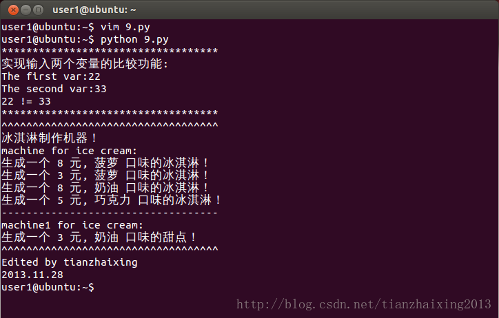

# python函数形参和实参


```
    #!/usr/bin/python
    #coding:utf8        #中文输入方式1
    #coding=utf8        #中文输入方式2
    #encoding:utf8        #中文输入方式3
    #encoding=utf8        #中文输入方式4
    #-*- coding:utf8 -*-#中文输入方式5

    print '*'*35
    print "实现输入两个变量的比较功能:"
    def fun(x,y):# x,y  形参
        if x == y:
            print x, '=', y
        else:
            print x, '!=', y
    x1 = raw_input("The first var:")
    x2 = raw_input("The second var:")

    fun(x1,x2)
    print '*'*35

    print '^'*35
    print "冰淇淋制作机器！"
    print "machine for ice cream:"
    def machine(x=8,y='菠萝'):#x,y形参，设置默认初值
        print "生成一个",x,'元,',y,'口味的冰淇淋！'

    #s1 = raw_input("input something:")
    #s2 = raw_input("input something:")
    machine()               #使用默认参量
    machine(3)              #只改变x参量
    machine(y='奶油')       #只改变y参量
    machine(5,'巧克力')     # s1,s2 shican
    print '-'*35

    print "machine1 for ice cream:"
    def machine1(y,x=3):#默认参数从右至左
        print "生成一个",x,'元,',y,'口味的甜点！'
    machine1('奶油')
    print "^"*35
    print "Edited by tianzhaixing"
    print "2013.11.28"
```


  
  


  


  


  


  


  


  