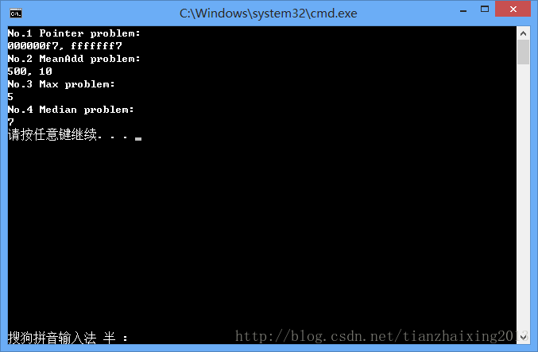

# 指针，比特位操作

为了找工作，最近在看《程序员面试宝典》第四版，发现之前学习C++都是太肤浅了。原来比特位操作还可以很灵活的运用哈...

  


1.用一个表达式判断一个数X是不是2的N次方（N为整数），不可用循环语句。

!(X&(X-1))

  


2.不使用任何中间变量，交换a和b的值。

a = a^b;

b = a^b;

a = a^b;

  


3.指针和基于比特位运算的小算法

  


```cpp
    #include <stdio.h>
    #include <cmath>

    int f(int x, int y)
    {
        return (x&y) + ((x^y)>>1);//实质功能：求取两个整数的均值
    }

    int Add(int x, int y)
    {
        if (y == 0)
        {
            return x;
        }
        int sum, carry;
        sum = x^y;             //第一步没有进位的加法运算
        carry = (x&y)<<1;      //第二步进位并且左移运算
        return Add(sum,carry);
    }

    inline int Max(int x, int y)
    {
        return ((x+y) + abs(x-y))/2;//选择两个整数中最大数，新思路
    }

    inline int max(int a, int b) {return a>=b? a:b;}
    inline int min(int a, int b) {return a<=b? a:b;}
    inline int medium(int a, int b, int c)
    {
        int t1 = max(a,b);
        int t2 = max(b,c);
        int t3 = max(a,c);
        return min(t1,min(t2,t3));
    }
    int main()
    {
        unsigned int a = 0xFFFFFF7;
        unsigned char i = (unsigned char)a;

        char* b = (char*)&a;
        /*
        * 等价于：
        * unsigned int *p = &a;
        * char* b = (char*)p;
        */
        printf("No.1 Pointer problem:\n");
        printf("%08x, %08x \n", i, *b);

        printf("No.2 MeanAdd problem:\n");
        int meanX = f(729,271);
        int addX = Add(2,8);
        printf("%d, %d\n", meanX, addX);


        printf("No.3 Max problem:\n");
        int maxv = Max(3,5);
        printf("%d\n",maxv);

        printf("No.4 Median problem:\n");
        int medianv = medium(3,7,9);
        printf("%d\n",medianv);

        return 0;
    }
```


  
  
```