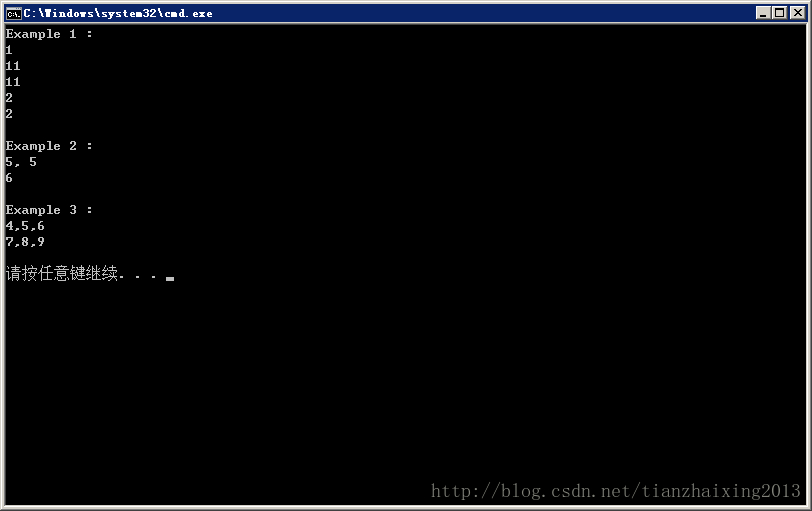

# 指针数组&&数组指针


```cpp
    #include <iostream>
    #include <cstdio>

    using namespace std;

    int main()
    {
        cout << "Example 1 :" << endl;
        int v[2][10] = {{1, 2, 3, 4, 5, 6, 7, 8, 9, 10}, {11, 12, 13, 14, 15, 16, 17, 18, 19, 20}};
        int (*a)[10] = v;             // 数组指针，即数组的指针

        cout << **a << endl;          // 数组指针，二维数组时，该指针为双指针

        cout << **(a + 1) << endl;    // a指针向后移动1*sizeof(数组大小), 1*4*10 = 40 byte
        cout << *(a[1]) << endl;      // a[0]第一行数组，a[1]第二行数组

        cout << *(*a + 1) << endl;    // *a+1针对第一行数组，向后移动1*4 = 4 byte
        cout << *(a[0] + 1) << endl;  // *a 等价于 a[0]
        cout << endl;


        cout << "Example 2 :" << endl;
        static int b[2] = {1, 2};
        int *ptr[5];                  // 指针数组

        int p1 = 5, p2 = 6;
        int *page1 = &p1;
        int *page2 = &p2;

        ptr[0] = &p1;
        ptr[1] = page2;

        cout << *ptr[0] << ", " << *page1 << endl;
        cout << *ptr[1] << endl << endl;

        cout << "Example 3 : " << endl;
        int Test1[2][3] = {{1, 2, 3}, {4, 5, 6}};
        int Test2[3]    = {7, 8, 9};

        int (*A)[3], (*B)[3];         // 数组指针
        A = &Test1[1];
        B = &Test2;
        cout << (*A)[0] << "," << (*A)[1] << "," << (*A)[2] << endl;
        cout << (*B)[0] << "," << (*B)[1] << "," << (*B)[2] << endl << endl;

        return 0;
    }
```


  


  
```