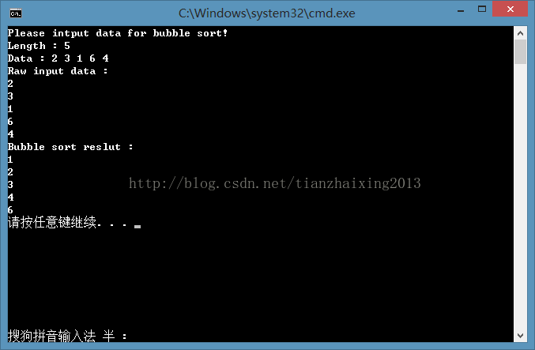

# 排序算法之--冒泡排序

冒泡排序的C++实现代码如下所示：

该冒泡排序的时间复杂度为O(n^2)，当将要排序的序列本身是排好的时候，该时间复杂度则为O(n)。


```cpp
    // Sort.cpp : 定义控制台应用程序的入口点。
    //

    #include "stdafx.h"
    #include <iostream>
    #include <string>

    using namespace std;

    template <typename T>
    void Bubble(T Array[], T length)
    {
        if (Array == NULL || length < 0)
        {
            return;
        }

        for (int j = 0; j < length; j++)
        {
            for (int i = 0; i < length-j-1; i++)// 因为是i+1, 所以防止越界length - 1,
            {
                if (Array[i] > Array[i+1])
                {
                    T tmp = Array[i];
                    Array[i] = Array[i+1];
                    Array[i+1] = tmp;
                }
            }// end for i

            //length--; // 等价于length - j

        }// end for j
    }


    int _tmain(int argc, _TCHAR* argv[])
    {
        cout << "Please intput data for bubble sort!" << endl;
        cout << "Length : ";
        int length = 0;
        cin >> length;

        if (0 == length)
        {
            cerr << "Check out the input length and input again!" << endl;
            cin >> length;
        }

        cout << "Data : ";

        int InData = 0;
        int *Array = new int[length * sizeof(int *)];// 分配内存空间

        for (int i = 0; i < length; i++)
        {
            cin >> InData;
            Array[i] = InData;
        }

        cout << "Raw input data : " << endl;
        for (int i = 0; i < length; i++)
        {
            cout << Array[i] << endl;
        }


        Bubble<int>(Array,length);

        cout << "Bubble sort reslut : " << endl;
        for (int k = 0; k < length; k++)
        {
            cout << Array[k] << endl;
        }

        delete []Array;

        return 0;
    }
```


  
  
```