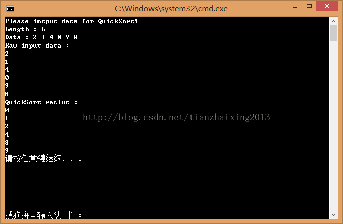

# 排序算法之--快速排序

快速排序算法是C.R.A.Hoare 在1962年提出的一种采用分治策略(分治法--Divide and Conquer Method)的划分交换排序算法。  
分治法的基本思想是将原问题分解为若干个规模更小，但结构和原问题相似的子问题；递归地解决这些子问题。  
  
快速排序的基本思想是：  
首先，在待排序数组Array中任选一个值作为基准Base；  
然后，以Base将当前待排序数组划分为左右两个子区间Array[low...Basepos-1]和Array[Basepos+1...high]，并使左边子区间的数值均小于等于Base，右边子区间的数值均大于等于Base。Base则位于正确的位置Basepos上，不参加后续的排序。Base = Array[Basepos], low <= Basepos <= high  
接着，递归调用快速排序对左右子区间快速排序；  


最后，组合递归调用快速排序结果，这里无序做任何操作，因为左右子区间已经排序完成。

  


```cpp
    // Sort.cpp : 定义控制台应用程序的入口点。
    //
    #include "stdafx.h"
    #include <iostream>
    #include <string>

    using namespace std;

    template <typename T>
    void QuickSort(T Array[], T m, T n)
    {
        if (Array == NULL || m >= n)
        {
            return;
        }

        int k, t, i, j;

        if (m < n)
        {
            i = m;
            j = n + 1;
            k = Array[m];

            while (i < j)
            {
                for (i = i + 1; i < n; i++)
                {
                    if (Array[i] > k)
                    {
                        break;
                    }
                }// 由左向右查找

                for (j = j - 1; j > m; j--)
                {
                    if (Array[j] < k)
                    {
                        break;
                    }
                }// 由右向左查找

                if (i < j)
                {
                    t = Array[i];
                    Array[i] = Array[j];
                    Array[j] = t;
                }// 交换更新后i与j位置对于的数值 ???
            }// end for i < j

            // 更新Base 和 Basepose
            t = Array[m];
            Array[m] = Array[j];
            Array[j] = t;

            // 递归快速排序左右子区间
            QuickSort(Array, m, j - 1);
            QuickSort(Array, i, n);
        }// end for m < n
    }


    int _tmain(int argc, _TCHAR* argv[])
    {
        cout << "Please intput data for QuickSort!" << endl;
        cout << "Length : ";
        int length = 0;
        cin >> length;

        if (0 == length)
        {
            cerr << "Check out the input length and input again!" << endl;
            cin >> length;
        }

        cout << "Data : ";

        int InData = 0;
        int *Array = new int[length * sizeof(int *)];// 分配内存空间

        for (int i = 0; i < length; i++)
        {
            cin >> InData;
            Array[i] = InData;
        }

        cout << "Raw input data : " << endl;
        for (int i = 0; i < length; i++)
        {
            cout << Array[i] << endl;
        }


        QuickSort<int>(Array, 0, length-1);

        cout << "QuickSort reslut : " << endl;
        for (int k = 0; k < length; k++)
        {
            cout << Array[k] << endl;
        }

        delete []Array;

        return 0;
    }
```


  
  
```