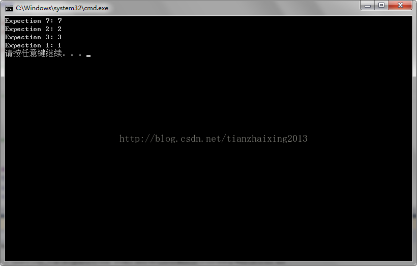
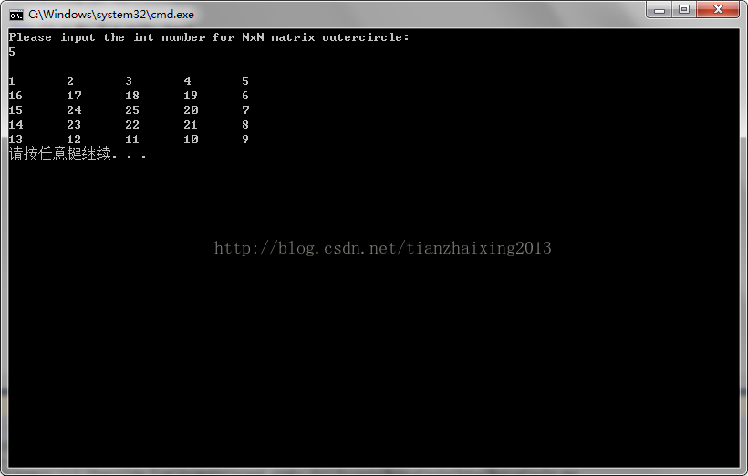

# 《程序员面试宝典》之螺旋队列问题学习

1.由内向外螺旋队列查找指定位置数值问题。


```cpp
    #include <iostream>
    #include <stdio.h>

    using namespace std;

    #define max(a,b) (a < b ? b : a)
    #define abs(a)   (a > 0 ? a : -a)

    int MatrixCircle(int x, int y)
    {
        /************************************************************************
        *           |北|上
        *            |                                7  8  9
            * 西|左 ————————————>x(+) 东|右   6  1  2
        *            |0(0,0)                          5  4  3
        *            |
        *           \|/y(+) 南|下        注明: 默认起始坐标(0,0)对应数值1
        *                                      x表示列, y表示行
        ************************************************************************/


        int t = max(abs(x), abs(y));// 确定所在层t
        int u = t + t;              // u = 2t
        int v = u - 1;              // v = 2t-1
        v = v * v + u;              // v = (2t-1)^2 + 2t

        if(x == -t)                 // 队列增长方向与Y轴反向, 正西方向(y=0)数值(2t-1)^2+5t, v = (2t-1)^2+5t-y
        {
            v += u + t -y;          // v = (2t-1)^2 + 2t + 2t + t - y = (2t-1)^2 + 5t - y
        }
        else
            if(y == -t)             // 队列增长方向与X轴同向, 正北方向(x=0)数值(2t-1)^2+7t, v = (2t-1)^2+7t+x
            {
              v += 3*u + x - t;     // v = (2t-1)^2 + 2t + 3*2t + x - t = (2t-1)^2 + 7t + x
            }
            else
            if(y == t)              // 队列增长方向与X轴反向, 正南方向(x=0)数值(2t-1)^2+3t, v = (2t-1)^2+3t-x
            {
               v += t - x;          // v = (2t-1)^2 + 2t + t - x = (2t-1)^2 + 3t - x
            }
            else                    // 队列增长方向与Y轴同向, 正东方向(y=0)数值(2t-1)^2+t, v = (2t-1)^2+t+y
            {
               v += y - t;          // v = (2t-1)^2 + 2t + y - t = (2t-1)^2 + t + y
            }

        return v;
    }

    int main()
    {
        cout << "Expection 7: " << MatrixCircle(-1, -1) << endl;
        cout << "Expection 2: " << MatrixCircle(1, 0) << endl;
        cout << "Expection 3: " << MatrixCircle(1, 1) << endl;
        cout << "Expection 1: " << MatrixCircle(0, 0) << endl;

        return 0;
    }
```
cpp


  




  


2.顺时针递增矩阵打印


```cpp
    #include <iostream>

    using namespace  std;

    int a[10][10] = {0};

    void OuterCircle(int n)
    {
        int m = 1, j, i;

        for (i = 0; i < n/2; i++)
        {
            for (j = 0; j < n-i; j++) // 左-->右:每次顺时针循环的左上角到右上角
            {
                if(a[i][j] == 0)
                a[i][j] = m++;
            }

            for (j = i + 1; j < n-i-1; j++)// 上-->下:每次顺时针循环的右上角到右下角
            {
                if(a[j][n-1-i] == 0)
                a[j][n-1-i] = m++;
            }

            for (j = n-i-1; j > i; j--)// 右-->左:每次顺时针循环的右下角到左下角
            {
                if(a[n-i-1][j] == 0)
                a[n-i-1][j] = m++;
            }

            for (j = n-i-1; j > i; j--)// 下-->上:每次顺时针循环的左下角到右上角
            {
                if(a[j][i] == 0)
                a[j][i] = m++;
            }
        }
        // n为奇数时,最后顺时针递增矩阵中心只剩一个元素
        if (n%2 == 1)
        {
            a[n/2][n/2] = m;
        }
    }
    int main()
    {
        cout << "Please input the int number for NxN matrix outercircle: " << endl;
        int n;
        cin >> n;
        cout << endl;

        // NxN矩阵由外向内顺时针循环打印矩阵值!
        OuterCircle(n);

        for (int j = 0; j < n; j++)
        {
            for(int i = 0; i < n; i++)
            {
                cout << a[j][i] << "\t";
            }
            cout << endl;
        }

        return 0;
    }
```


  
  