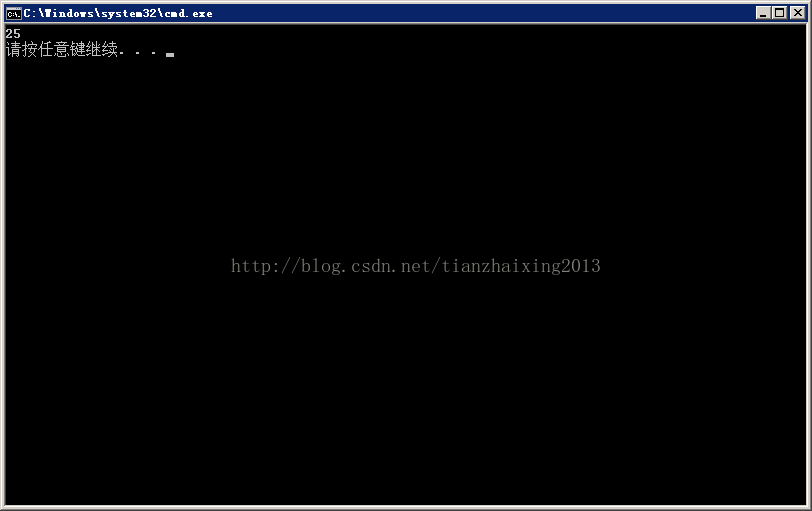

# 《程序员面试宝典-第四版》之递归学习

本文主要是类似杨辉三角阵的两种不同实现算法...

  


```cpp
    /**
    * Problem:
    * if m = 1, f(m,n) = n;
    * if n = 1, f(m,n) = m;
    * if m > 1, n > 1, f(m,n) = f(m-1,n) + f(m,n-1)
    */

    #include <iostream>

    using namespace std;

    #define RECURSION 0
    #define NO_RECURSION 1

    // !< Recursion version
    #if RECURSION
    int f(int m, int n)
    {
        if (1 == m)
        {
            return n;
        }
        if (1 == n)
        {
            return m;
        }
        return f(m-1,n) + f(m,n-1);
    }
    #endif

    // !< Not recursion version
    #if NO_RECURSION
    int f(int m, int n)
    {
        int a[100][100] = {0};

        for (int i = 0; i != m; ++i)
        {
            a[i][0] = i + 1;        // 第一列每行递增
        }
        for (int i = 0; i != n; ++i)
        {
            a[0][i] = i + 1;        // 第一行每列递增
        }

        for (int i = 1; i != m; ++i)
        {
            for (int j = 1; j != n; ++j)
            {
                a[i][j] = a[i-1][j] + a[i][j-1];
            }
        }
        return a[m-1][n-1];
    }
    #endif

    int main()
    {
        cout << f(3, 4) << endl;
        return 0;
    }
```


  
  
```