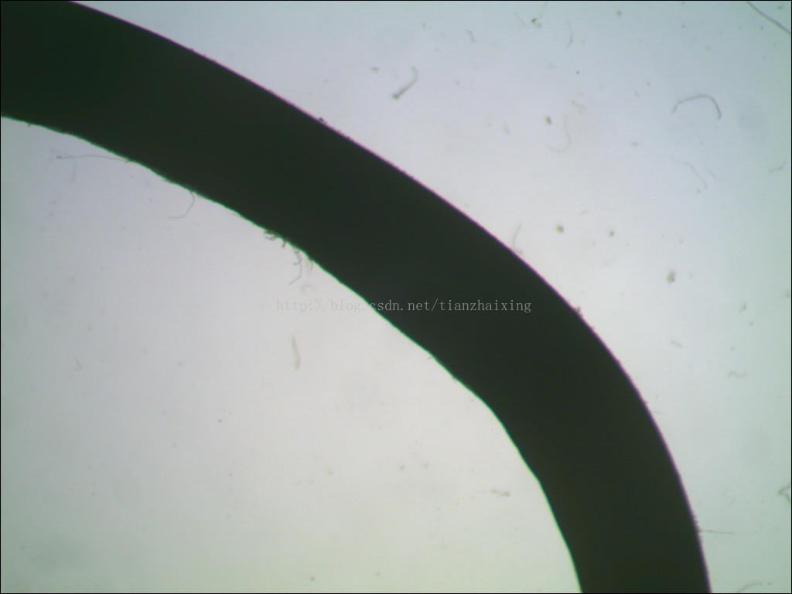
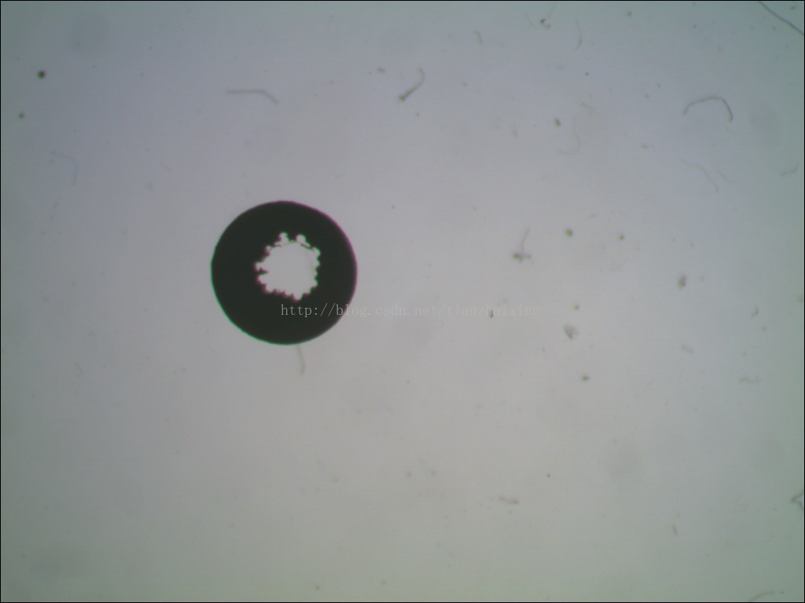

# 计算机视觉期末报告---项目二

电缆外包皮厚度检测。线缆厂需要对电缆的外包皮进行厚度检测，以确定电缆的质量。已经给出各种电缆的横截面切片图（见附件），需要通过计算机视觉处理，检测电缆外包皮的厚度。

基本要求：

1、采用C语言编程（不允许使用MATLAB），设计图像识别程序，能够对已知图像序列进行厚度计算。需要计算平均厚度，最小厚度，最大厚度。（注意：厚度定义是以外轮廓为基准，外轮廓的边缘以法线方向到内轮廓边缘的距离），要求对处理过程进行详细说明。

2、每张图片处理时间小于50ms，误差小于2个像素。

提交形式：

1、 以文本形式提交，详细说明图像处理的步骤，每个步骤图像处理的效果，每种图片的计算结果，处理图像效果，计算时间，计算精度。

2、 提供程序源代码。

3、 难度系数：**

提交时间：2013年7月10日

  

  

  

  

  